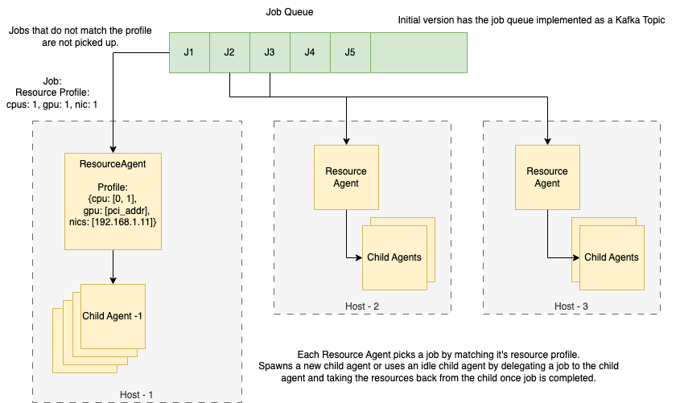
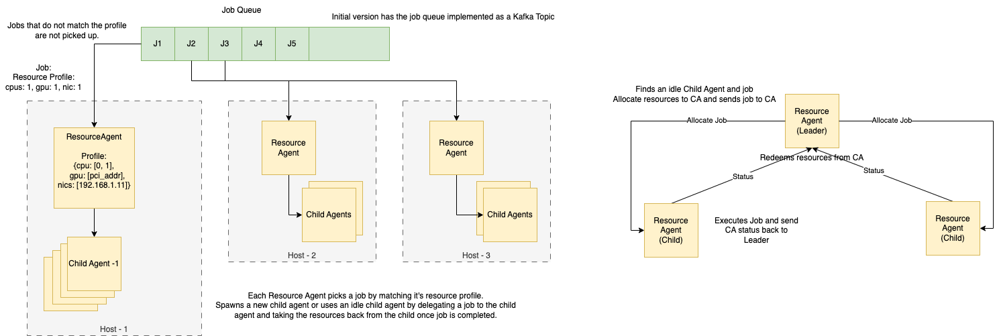

# Swarm Agent Simulation
This package contains a simulation for a SWARM Agent using the [repast4-py](https://repast.github.io/) framework.
It implements a basic distributed resource allocation algorithm based on the design shown below:

## Design Overview
- Each host runs a Resource Agent (RA) which has complete information of all the resources available on that host.
- RA does following:
  - Agent with Rank 0 runs as Leader Agent
  - RA picks a job from the Job Queue (Kafka topic) matching the resources available to RA. 
  - RA finds an idle Child Agent (CA) and allocates resources to CA and marks CA as running.
  - RA sends the  resource and job info to CA.
  - RA processes incoming Status message from CA to redeem any allocated resources and updates CA state.
- CA does following:
  - Agent with Rank > 0 runs as Child Agent
  - CA runs the job.
  - CA sends Status message back to RA containing state information.

## Usage
Swarm Agent on a host can be launched via:
` mpiexec -n 4 python -m simulation.host_controller`

Jobs can be added to the Job Queue via Job Producer:
`python job_producer.py`

## Tests
MPI message exchange helper can be tested via:
` mpiexec -n 2 python -m simulation.tests.message_tests`

## Limitations
This simulation tries to use Repast framework but doesn't benefit much from it and can be implemented without Repast.